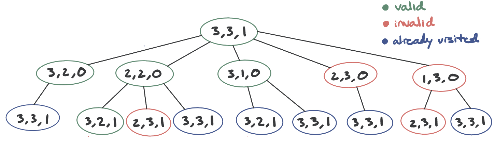

## A1: Foxes and Chickens
#### Kevin King, 9/18/23
#### COSC 76 23F

### Introduction
Upper Bound on # Possible States:

* Let `F` be the total number of foxes and `C` the total number of chickens
* Number of possible states for foxes: `F+1` (ranging from 0 to F on one side)
* Number of possible states for chickens: `C+1` (ranging from 0 to C on one side)
* Number of possible states for boats: 2 (one for each side)

Thus, the total number of possible states (aka the upper bound):
`(F+1) * (C+1) * 2`

For the case in which we start with 3 foxes and 3 chickens:
The possible states for foxes would be: 0, 1, 2, and 3. That's a total of four possible states.
Similarly, for chickens, the possible states would also be four: 0, 1, 2, and 3.
The boat position can be one of two states: 0 or 1. 
Thus, the number of possible states for (3,3,1): 4 * 4 * 2 = 32

See below for the illustration of a part of the graph of states

### Memoizing DFS
*Q: Does memoizing dfs save significant memory with respect to breadth-first 
search? Why or why not?*

BFS: Uses a queue that keeps track of nodes to be explored. Thus, in the worst case, 
the queue will have every adjacent vertex of the current level in memory at once. The 
runtime is O(V) where V is the number of vertices. 

Memoizing DFS: Uses a stack as well as a set to keep track of the visited nodes. Here, 
DFS will only have a single path in memory at once and the max memory usage will be proportional
to the depth of the deepest path. The runtime is O(D) where D is the depth of the deepest node. 

In terms of memory usage, memoizing DFS can be more memory-efficient than BFS, especially in 
denser graphs or when the solution is deep in the search space. This is because BFS might have 
to store many nodes at a particular depth level, while DFS only needs to store the nodes on the current path.

### Path-checking DFS
*Q: Does path-checking depth-first search save significant memory with respect 
to breadth-first search? Draw an example of a graph where path-checking dfs 
takes much more run-time than breadth-first search; include in your report 
and discuss.*

Path-checking DFS: 
* Tracks nodes on the current path being explored. A node is ignored If it has been visited before on 
the current path. 
* Memory consumption is linear with respect to the maximum depth of the graph: O(D)

BFS: 
* Explores layer by layer, ensuring all nodes of a given depth are explored before moving on. 
* Can potentially use more memory as it stores all frontier nodes at a particular depth. The worst 
case runtime is O(V) where V is the number of vertices

Example scenario:

* BFS will find the solution almost immediately after visiting the start node, as the goal state 
is two layers lower
* Path-checking DFS will first go deep down the leftmost branch before 
backtracking and eventually finding the solution. This can result in significant runtime, especially 
if the tree is very deep.

While path-checking DFS might save on memory usage compared to BFS, its runtime can be significantly 
higher in specific scenarios. In graphs where the solution is shallow or at a moderate depth, BFS 
will find the solution faster, while path-checking DFS can get "trapped" exploring deep paths that 
don't lead to an optimal solution. The choice between the two should be based on the nature of the problem 
and the expected structure of the input graph.

### Iterative Deepening Search
*Q: On a graph, would it make sense to use path-checking dfs, or would you 
prefer memoizing dfs in your iterative deepening search? Consider both time 
and memory aspects. (Hint. If it’s not better than bfs, just use bfs.)*

IDS with memoizing DFS vs. BFS:
* BFS will traverse the graph to all adjacent nodes (neighbors) of the start node, then all the adjacent nodes of those
(and so on). This process would not have re-build the tree at the end of each search for a specific depth 
level. Both will use similar amounts of memory as they visit each node once, but BFS is faster because IDS has to re-build
the previous (d-1) layers of the graph. 

IDS with path-checking DFS vs. BFS:
* IDS with path-checking DFS will use less memory as it doesn't store the nodes it visits. However, BFS is faster because 
it takes constant time to lookup in a set if a node has been visited. When graphs are smaller, BFS is best because memoizing
would not be as expensive, whereas IDS with path-checking DFS is better on bigger graphs where memoizing would be harder.

### Discussion Q: Lossy Chickens and Foxes
*Q: Every fox knows the saying that you can’t make an omelet without breaking a 
few eggs. What if, in the service of their community, some chickens were 
willing to be made into lunch? Let us design a problem where no more than 
E chickens could be eaten, where E is some constant. What would the state for 
this problem be? What changes would you have to make to your code to implement 
a solution? Give an upper bound on the number of possible states for this 
problem. (You need not implement anything here.)*

State Representation: 
Whereas the state for the original problem would be a triple: `(chickens, foxes, boat)`, 
the inclusion of a possible number of chickens being eaten would expand the state to four elements:
`(chickens, foxes, boat, chickens_eaten)`, where `chickens_eaten` is initialized to 0

Code Changes:
* `goal_test`: Would need to check that the number of `chickens_eaten` doesn't exceed the value `E`
* `get_successors`: When we encounter an invalid state, you would:
  * increment `chickens_eaten` by the difference
  * continue the search from that state after checking that `chickens_eaten` is within the allowable 
  limit `E`

Upper Bound on # Possible States:

* Let `F` be the total number of foxes, `C` the total number of chickens, and `E` the max number of 
chickens that can be eaten. 
* Number of possible states for foxes: `F+1` (ranging from 0 to F on one side)
* Number of possible states for chickens: `C+1` (ranging from 0 to C on one side)
* Number of possible states for boats: 2 (one for each side)
* Number of possible states for chickens eaten: `E+1` (ranging from 0 to E)

Thus, the total number of possible states (aka the upper bound):
`(F+1) * (C+1) * 2 * (E+1)`

In practice, however, not all the combinations would be valid states due to the problem constraints
(i.e., foxes can never outnumber chickens unless they are equal to zero or within the allowable limit)

### Extra Credit
I illustrated the states to show how many animals were on each side at a given point in the path solution as well 
as the side of the river that the boat is on. To do this, I made edits to the `SearchSolution.py` code.