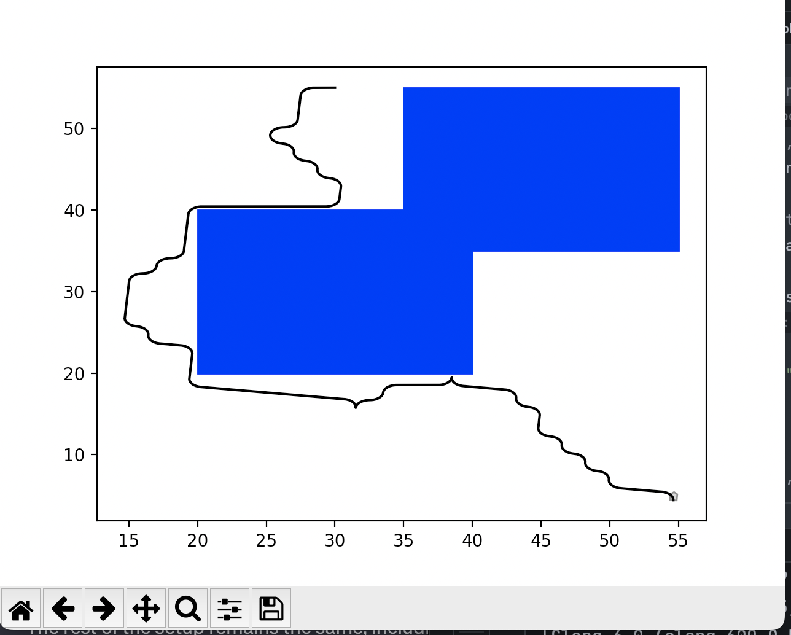

# A7: Motion Planning with PRM and RRT
### Kevin King
### Dartmouth COSC 76, Fall 2023

## PRM
Implementation Details
* `AstarNode` class: Represents a node in the A* search algorithm. Each node stores its state (arm configuration), 
the cost to reach the node, the heuristic estimate to the goal, and a reference to its parent node.
* `AstarSolution` class: Used to store information about the solution path found by A* search, including the path 
itself, the total cost of the path, and the number of nodes visited during the search.
* `PRM` class: The core class for creating and searching the probabilistic roadmap.

Initialization: Takes arm lengths and obstacles as input and converts obstacles to Polygon objects for collision detection.
* `setup` method: Creates the PRM graph by randomly sampling configurations (vertices) and connecting them to 
their nearest neighbors (edges) if they don't collide with obstacles.
* `query` method: Used to find a path from an initial to a final configuration. It adds these configurations to the
PRM and uses the A* search algorithm to find a path.
* `astar`_search method: Implements the A* search algorithm on the PRM graph.
* Other methods like `create_polygon`, `config_to_coords`, `check_collisions`, `random_config`, `heuristic`, `nearest_neighbors`, 
`connect_configs`, `can_connect`, `get_successors`, and `backchain` support the functionality of the PRM and A* search by 
providing essential utilities like collision checking, heuristic calculation, and graph construction.
* I also used the scikit `NearestNeighbors` to determine the nearest neighbors 

`ArmVisualizer` (extension)
* We weren't required to display the graphics for the PRM, but I wrote this class to use `cs1lib` to simulate the paths

## RRT (Extension)
Implementation Details
* `Node` class: Represents a node in the RRT. It stores the state (position and orientation), a reference to the parent node, the path leading to this node, and the move that led to this state.
* `RRT` class: The core class for the rapidly-exploring random tree

Initialization: Sets up the boundary, step size for exploration, and obstacle geometries.
* `create_borders`: Creates border lines for the navigational space.
* `expand_vertex`: Expands the tree from the nearest vertex towards a random configuration.
* `run`: Executes the RRT algorithm. It randomly samples configurations and incrementally builds the tree until a path to the goal is found or the iteration limit is reached.
* `child_config`: Generates a new configuration based on a move index, using the PlanarTrajectory for motion planning.
* `goal_test`: Checks if a given state is within a threshold distance of the goal.
* `random_config`: Generates a random configuration within the defined boundary.
* `check_collision`: Checks if a configuration collides with any obstacles.
* `nearest_vertex`: Finds the nearest vertex in the tree to a given configuration using the Nearest Neighbors algorithm.
* `draw_result`: Visualizes the resulting path using matplotlib.
* `is_far_enough`: Determines if a point is sufficiently far from other points.
* `generate_obstacles`: Generates random obstacles in the navigational space.
* `generate_test_case`: Creates a test case with random start and goal configurations and obstacles.


## Testing
### PRM
Run the `prm.py` file to view the graphics simulation of the arm path
```bibtex
obstacles = [((1, 4), (2, 5)), ((5, 1), (6, 2))]
arm_lengths = [4, 4, 5, 5]

prm_model = PRM(arm_lengths, obstacles)
vertices, edges = prm_model.setup(n=5000, k=5)

init_config = (45, 60, 45, 90)
final_config = (10, 80, 15, 45)

Output: 
Path found: [(45, 60, 45, 90), 
(33.07761007796282, 61.183249364058746, 32.712006583001376, 82.8785481694194), 
(15.603845168716791, 63.88166666320267, 16.25510314084568, 66.74358815206189), 
(15.648585083152962, 65.76314762419233, 15.067867002118724, 50.529924427377296), 
(10, 80, 15, 45)]
```

```bibtex
obstacles = [((1, 4), (2, 5)), ((5, 1), (6, 2))]
arm_lengths = [4, 4, 5, 5]

prm_model = PRM(arm_lengths, obstacles)
vertices, edges = prm_model.setup(n=10000, k=3)

init_config = (45, 60, 45, 90)
final_config = (10, 80, 15, 45)

Output: 
Path found: [(45, 60, 45, 90), 
(46.31806930977772, 55.11967225229662, 45.65061534775561, 78.40357110166924), 
(40.02993648653189, 62.6355802240402, 42.148144842414084, 69.1030109954369), 
(34.24096006905079, 64.2902334651421, 43.86905876432971, 67.20720931467815), 
(26.869108618355956, 64.08276640630038, 38.73448973733816, 62.68721772432042), 
(27.63311252191552, 68.00090350527236, 29.45008467880953, 64.15549200199129), 
(28.361607940247453, 73.93738093667889, 16.85461472748466, 44.77722643555576), 
(18.644590353325782, 68.3653233236614, 11.001097214999298, 46.525269934166936), 
(10, 80, 15, 45)]
```
First Test Results: The path found comprises a sequence of configurations leading from the initial to the final configuration. The path seems relatively direct, possibly due to a higher number of neighbors considered (k=5), which typically results in a more connected graph.

Second Test Results: With more vertices (n=10000) but fewer neighbors (k=3), the path found is longer, containing more intermediate configurations. This may suggest that although the PRM has more potential points to traverse (due to the higher number of vertices), the reduced neighbor count per vertex leads to a less directly connected path.

### RRT
Run the `rrt.py` file to view the graphics window of the car path. I've attached some samples below:



